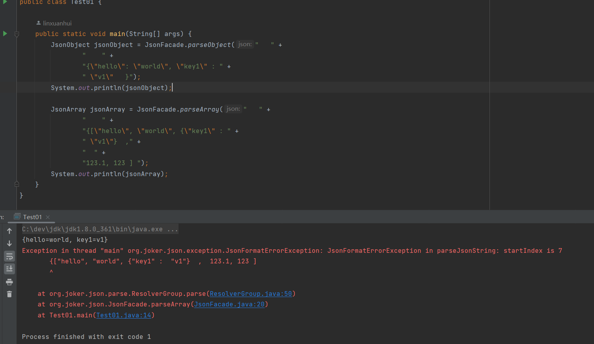

手写将 Json 解析成对应的Map或List的组件，如果格式错误会报错并指示从哪里开始格式不对


如下演示了一个正确的json格式解析与一个错误的json格式解析：


```java
import org.joker.json.JsonArray;
import org.joker.json.JsonFacade;
import org.joker.json.JsonObject;

public class Test01 {

    public static void main(String[] args) {
        JsonObject jsonObject = JsonFacade.parseObject("   " +
                "    " +
                "{\"hello\": \"world\", \"key1\" : " +
                " \"v1\"   }");
        System.out.println(jsonObject);

        JsonArray jsonArray = JsonFacade.parseArray("   " +
                "    " +
                "{[\"hello\", \"world\", {\"key1\" : " +
                " \"v1\"}  ," +
                "  " +
                "123.1, 123 ] ");
        System.out.println(jsonArray);
    }
}
```



